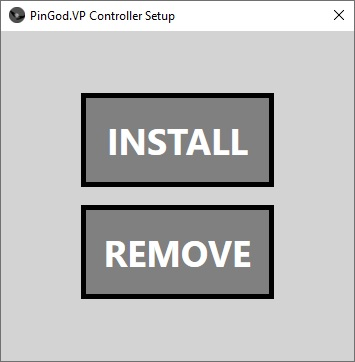

# pingod-controller-com
 4.72

A COM controller written in C# to send / receive pinball machine events over a windows memory mapping. This is a quick way to interop the `pingod` display with a simulator.

See the [pingod-memorymap-win](http://github.com/FlippingFlips/pingod-addons/addons/pingod-memorymap-win) plug-in in the [pingod-addons](http://github.com/FlippingFlips/pingod-addons/pingod-addons) to enable it in projects.

---
## How it works?
The `pingod-addons` have a copy of the memory mapping class. The memory map will create a `mutex` and a new memory mapping. Either will create or open the mapping depending on who was first to do so.

States are written to memory from the simulator and the game so both do read / write. See the `tests` to run through it.

---
## Controller Registry
For `Visual Pinball` and `Future Pinball` simulators that use Visual Basic Script for scripting their games installed COM objects can be accessed from the simulator scripts as long as they are registered on the system.

## Registry Installer
Use the setup registry application to simplify `regasm` usage. This can be installed anywhere but if you move the `PinGod.VP.dll` then you can re-register in another location.



---
## VP Table Setup
- Tables must have a `PinMameTimer` and `PulseTimer` Timer objects to get updates from controller. This is the same as any PinMame game.

---
## Visual Pinball Setup
Visual pinball keeps machine settings and global scripts in its `Scripts` directory. Copy the following to `VisualPinball/Scripts`
|Script|Description|
|-|-|
[core_c_sharp.vbs](PinGod.VP.Domain/Scripts/core_c_sharp.vbs)| A copy of `core.vbs` compatible with C# methods on the interface.
[PinGod.vbs](PinGod.VP.Domain/Scripts/PinGod.vbs)| Base machine config for cabinet switches, flippers

---
## VP Constants

|Constant|Description|
|-|-|
|Const UseSolenoids = 1|Enable / Disable checking the solenoid states|
|Const UseLamps = 1|Enable / Disable checking the lamp states|
|Const UsePdbLeds = 1|Enable / Disable checking the led states|

*Must be excplitly set to 0 if not using them and want to save some process* See `core_c_sharp.vbs`

---
## Run Game / Display
Options here are to run `IsDebug` or from a release executable. The `IsDebug` requires the system to have `godot` in the system paths.

|Constant|Description|
|-|-|
|Const IsDebug = True|Enable to RunDebug|
|Const GameDirectory|Path to game project or executable|

From the controller interface you can use:

|Method|Description|
|-|-|
RunDebug|Runs `godot` with the given project directory
Run|Runs an exported game executable without debug.

_* The Game directory can also be run from a relative path, it doesn't have to be the full path._

```
RunDebug GetPlayerHWnd, GameDirectory
Run GetPlayerHWnd, GameExe
```

---
## Override Display Settings
The interface holds some properties to make it a little easier if you want to change the display when launched. You can also just use the `Arguments` properties to send in custom args to the game or godot.

```
	' Run game on second display full screen
	With Controller 
	.DisplayOverideOn   = true	
	.DisplayFullScreen  = true	
	.DisplayScreen	    = 1
```
```
	' Run game with a different size
	With Controller 
	.DisplayOverideOn   = true	
	.DisplayWidth  		= 640
	.DisplayHeight	    = 480
	.DisplayAlwaysOnTop = true
```

---
#### Display Properties

|Constant|Description|
|-|-|
bool DisplayOverideOn | Enable this to use the properties below
bool DisplayFullScreen | run fullscreen
int DisplayWidth | width
int DisplayHeight | heigh
int DisplayX | pos x
int DisplayY | pos y
bool DisplayAlwaysOnTop | On top
bool DisplayMaximized | maximized
bool DisplayWindowed | Run in window
int DisplayScreen | Which screen to put the display on

---
## Machine Items
By default the memory mapping is allocated a set number of items. The amount here should match the totals in the `pingod` game. If you add `64` coils here you also need to match the mapping there in the `MemoryMapNode` scene.

|Map|Length|Desc|
|-|-|-|
|GameState| 1 | GameSyncState 0 = none, 1 = started, 2 = quit. See `pingod-addons` for all states |
|Coils| 32 ||
|Lamps| 64 ||
|Leds| 64 ||
|Switches| 128 ||

If you want to increase you can add properties like the above display properties when creating the controller.

```
With Controller
.LampCount			= 81
.LedCount			= 72
.CoilCount			= 63
```
---
## GameSyncState
Game states can be sent to the first index in the memory mapping. Controller methods will set the state.

|State|value|Method
|-|-|-|
|None| 0 ||
|Started| 1 |`GameRunning` is set when this changes|
|Quit*| 2 | Stop |
|Pause| 3 | Pause (1) |
|Resume| 4 | Pause (0) |
|Reset| 5 | Reset |

*No matter where the quit was invoked from both simulator and window should close.

---
## Sending switches From Script
`Controller.Switch 69, 1`

`Controller.Switch 64, 0`

`vpmPulseSw 69`

### Sending custom 
You could set aside a switch number to use for custom commands. Send any byte value to the switch 80 and pick up on that from your game. If you set the `VpCommandSwitch` number then the game will overide the `SetSwitch` for normal machine switch.

`Controller.Switch 80, 255`